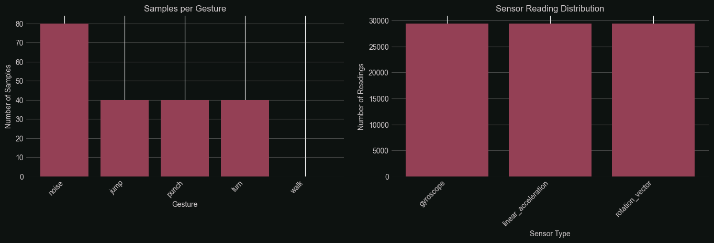

# Silksong Motion Controller v3 - Pixel Watch Edition

Control Hollow Knight: Silksong using motion gestures from a Pixel Watch! This project uses real-time sensor data (accelerometer, gyroscope, rotation vector, step detector) streamed over UDP from an Android Wear OS app to a Python controller that simulates keyboard inputs.

Building on top of [V2](https://github.com/CarlKho-Minerva/v2_SilksongController_25TPE)

<div>
    <a href="https://www.loom.com/share/175721940a354cb98fe0ec2a13e2bddf">
      <p>1 - Watch Data Transmitted! - Watch Video</p>
    </a>
    <a href="https://www.loom.com/share/175721940a354cb98fe0ec2a13e2bddf">
      
    </a>
  </div>


<div>
    <a href="https://www.loom.com/share/dfb0398e038c409084696484e159a588">
      <p>SVM Live Demo (Bad Performance)- Watch Video</p>
    </a>
    <a href="https://www.loom.com/share/dfb0398e038c409084696484e159a588">
      
    </a>
  </div>

## 🎮 Features



- **Motion-based game control**: Walk, jump, attack, and turn using natural body movements
- **Pixel Watch integration**: Wear OS app captures sensor data from your smartwatch
- **Automatic device discovery**: "Magic link" feature - no manual IP configuration needed! 🎯
- **Real-time UDP streaming**: Low-latency sensor data transmission
- **Configurable thresholds**: Calibrate sensitivity for different play styles
- **Cross-platform Python backend**: Works on Windows, macOS, and Linux

## 📁 Project Structure

```text
v3-watch_SilksongController_25TPE/
├── Android/                    # Wear OS Android app
│   └── app/
│       ├── build.gradle.kts   # Android build configuration
│       └── src/main/
│           ├── AndroidManifest.xml
│           └── java/com/cvk/silksongcontroller/
│               └── MainActivity.kt
├── src/                       # Python source code
│   ├── udp_listener.py       # Main controller logic
│   ├── network_utils.py      # UDP network handling
│   ├── calibrate.py          # Calibration tool
│   ├── data_collector.py     # Phase II: ML training data collection
│   └── feature_extractor.py  # Phase III: Feature engineering module
├── models/                    # Trained ML models (Phase III output)
│   ├── gesture_classifier.pkl
│   ├── feature_scaler.pkl
│   └── README.md
├── docs/                      # Documentation
│   ├── Phase_II/             # Data collection guides
│   └── Phase_III/            # ML pipeline documentation
├── installer/                # Installation scripts and templates
│   ├── INSTALLATION_GUIDE.md
│   ├── run_controller.sh/bat
│   └── run_calibration.sh/bat
├── CS156_Silksong_Watch.ipynb # Phase III: ML Pipeline Notebook
├── config.json              # Runtime configuration
└── requirements.txt         # Python dependencies (includes ML libs)
```

## 🚀 Quick Start

### Prerequisites

- **Hardware**: Pixel Watch or compatible Wear OS device
- **Software**:
  - Android Studio (for building the watch app)
  - Python 3.8+ (for the controller)
  - Hollow Knight: Silksong (game)

### Installation

1. **Clone the repository**

   ```bash
   git clone https://github.com/CarlKho-Minerva/v3-watch_SilksongController_25TPE.git
   cd v3-watch_SilksongController_25TPE
   ```

2. **Install Python dependencies**

   ```bash
   pip install -r requirements.txt
   ```

3. **Build and install the Android app**
   - Open `Android/` folder in Android Studio
   - Build and deploy to your Pixel Watch
   - ✨ The app will automatically discover your computer on the network!

4. **Run calibration**

   ```bash
   python src/calibrate.py
   ```

5. **Start the controller**

   ```bash
   python src/udp_listener.py
   ```

See `installer/INSTALLATION_GUIDE.md` for detailed setup instructions.

## 🌟 Automatic Connection

The controller features **automatic device discovery** using Network Service Discovery (NSD):

1. **Start the Python controller** - it automatically advertises itself on your local network
2. **Launch the watch app** - watch the connection status at the top:
   - 🟠 "Searching..." - discovering services
   - 🟢 "Connected!" - server found and ready
3. **Start playing!** - no manual IP configuration needed

The watch app will automatically find your computer if both devices are on the same WiFi network. Manual IP entry is still available as a fallback option.

## ⚙️ Configuration

Edit `config.json` to adjust:

- **Network settings**: IP address and port
- **Thresholds**: Sensitivity for gestures (punch, jump, turn, walk)
- **Keyboard mappings**: Custom key bindings

## 📊 Phase II: Machine Learning Data Collection

In addition to real-time gesture control, this project includes a guided data collection system for training ML models:

```bash
python src/data_collector.py
```

This tool:

- Guides you through structured gesture recording sessions
- Defines clear physical stances (Combat, Neutral, Travel)
- Records labeled IMU sensor data for 8 different gestures
- Exports training data in ML-ready CSV format
- Takes ~20-30 minutes for a complete session

**Use Cases**:

- Train personalized gesture recognition models
- Build more robust classifiers than threshold-based detection
- Research and experimentation with IMU gesture recognition
- Create custom gesture sets

See `docs/Phase_II/DATA_COLLECTION_GUIDE.md` for full documentation.

## 🤖 Phase III: Machine Learning Pipeline

Transform collected sensor data into a trained gesture recognition model using a comprehensive Jupyter Notebook:

```bash
# Install ML dependencies
pip install -r requirements.txt

# Run the ML pipeline notebook
jupyter notebook CS156_Silksong_Watch.ipynb
```

**The notebook includes:**

- ✅ Data loading and exploration
- ✅ Feature engineering (~60+ features from time-series data)
- ✅ Model training (SVM with RBF kernel + Random Forest)
- ✅ Hyperparameter tuning via GridSearchCV
- ✅ Model evaluation and validation
- ✅ Model serialization for deployment

**Output Models:**

- `models/gesture_classifier.pkl` - Trained SVM classifier
- `models/feature_scaler.pkl` - Feature normalization scaler
- `models/feature_names.pkl` - Feature reference list
- `models/model_metadata.json` - Performance metrics

**Performance Targets:**

- Test accuracy: >85%
- Real-time latency: <100ms
- Confidence threshold: 0.7 (70%)

See `docs/Phase_III/README.md` for complete ML pipeline documentation.

## 🚀 Phase IV: Real-Time Deployment (Coming Soon)

Integrate trained ML models into the controller for gesture-based predictions:

- Load trained model and scaler at startup
- Implement sliding window buffer for sensor data
- Extract features and predict gestures in real-time
- Execute actions based on predictions with confidence thresholding

See `docs/Phase_III/PHASE_IV_INTEGRATION.md` for integration guide.

## 🔧 Development

### Android Package

The Android app uses package name: `com.cvk.silksongcontroller`

To modify the Android app:

1. Open `Android/` in Android Studio
2. Main code is in `Android/app/src/main/java/com/cvk/silksongcontroller/MainActivity.kt`
3. Edit layouts in `Android/app/src/main/res/layout/`

### Python Controller

Main entry point: `src/udp_listener.py`

- Receives UDP packets from watch
- Processes sensor data to detect gestures
- Simulates keyboard inputs

## 📝 License

MIT License - see LICENSE file for details

## 🙏 Acknowledgments

Based on the original v2 SilksongController project with enhancements for Pixel Watch compatibility and improved gesture recognition.
